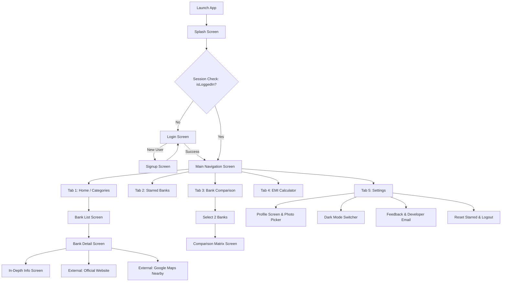
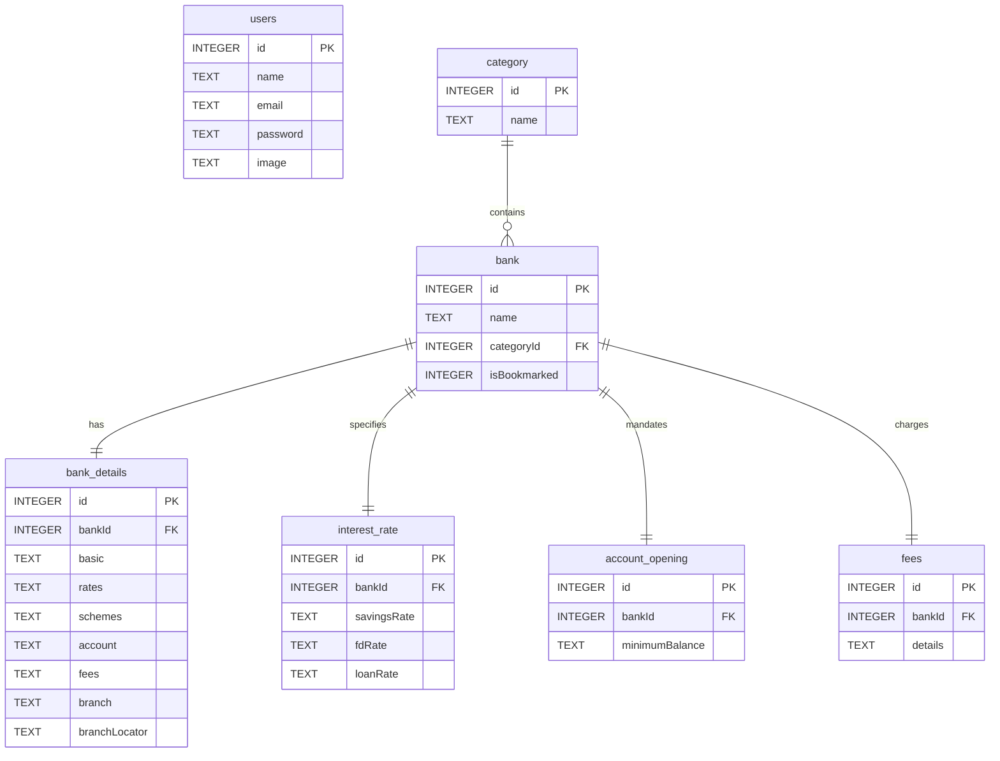

# 🏦 BankMate

> **Offline Banking Information, Comparison & Financial Utility App**  
> *Empowering users with transparent, easily accessible banking knowledge anytime, anywhere — no active internet connection required.*

---

[](https://flutter.dev)
[](https://dart.dev)
[](https://www.sqlite.org/)
[](https://m3.material.io/)
[](#)
[](#)

---

## 📖 Table of Contents

- [Overview](#-overview)
- [Key Features](#-key-features)
- [Supported Banks & Categories](#-supported-banks--categories)
- [Application Architecture & Flow](#-application-architecture--flow)
- [Database Design & Schema](#-database-design--schema)
- [Directory & File Structure](#-directory--file-structure)
- [Technology Stack](#-technology-stack)
- [Getting Started & Installation](#-getting-started--installation)
- [Configuration & API Setup](#-configuration--api-setup)
- [Testing & Verification](#-testing--verification)
- [Roadmap & Future Enhancements](#-roadmap--future-enhancements)
- [Author & Acknowledgements](#-author--acknowledgements)

---

## 🌟 Overview

**BankMate** is an offline-first mobile application developed using Flutter. In an era where financial literacy and quick access to banking data are essential, many individuals face challenges navigating complex fee structures, interest rates, minimum balance mandates, and government schemes — especially in regions with unreliable internet access.

BankMate solves this problem by packaging comprehensive banking knowledge into an embedded, high-performance SQLite database. Users can explore institution profiles, evaluate account types, compare loan and deposit rates side-by-side, calculate loan EMIs, and navigate to local branches directly from their device.

---

## 🚀 Key Features

### 1. 🏛️ Comprehensive Offline Bank Directory
- Complete profiles of **12 prominent Indian banks** across Public, Government, and Co-operative sectors.
- Organized into deep, digestible modules:
  - **Basic Information**: Institutional history, background, corporate office, network scale, and primary services.
  - **Interest Rates**: Savings account returns, Fixed Deposit (FD) slabs, and retail loan interest rates.
  - **Banking Schemes**: Flagship initiatives such as PMJDY, Sukanya Samriddhi Yojana, PPF, Senior Citizen schemes, and Mudra loans.
  - **Account Types**: Savings, Current, Salary, and Senior Citizen account rules and minimum balance criteria.
  - **Fees & Charges**: Debit card annual fees, SMS alert charges, non-maintenance penalties, and ATM transaction caps.
  - **Direct External Actions**: One-tap launch to official web portals and direct Google Maps branch locator queries.

### 2. ⚖️ Side-by-Side Bank Comparison
- Select any two banks to conduct an instant, detailed comparison.
- Compares metrics such as:
  - Savings account interest rates
  - Fixed Deposit (FD) rates
  - Retail loan interest rates
  - Minimum balance requirements (Metro / Urban / Rural)
  - Debit card annual fees and transaction charges

### 3. 🧮 Interactive Loan EMI Calculator
- Real-time loan repayment computation based on:
  - Loan Principal amount (₹)
  - Annual Interest Rate (%)
  - Loan Tenure (Years)
- Computes monthly installment values using standard mathematical amortization formulas with instant reset capabilities.

### 4. 📍 Geolocation & Branch Locator
- Integrated with device GPS via `geolocator` to identify user coordinates.
- Supports querying nearby branches and ATMs via Google Places API and opens route directions in Google Maps.

### 5. 🌙 Adaptive Material 3 Theming
- Native support for **Dark Mode** and **Light Mode**.
- Global theme state persistence managed through `ValueNotifier` and `SharedPreferences`.

### 6. ⭐ Bookmarking (Starred Banks)
- Save frequently accessed banks to a dedicated **Starred Banks** tab for 1-tap lookup.
- Fast toggle action available directly from list views and detailed profile pages.

### 7. 👤 User Authentication & Profile Customization
- Local registration, login, and session persistence.
- Profile picture customization using device gallery integration via `image_picker`.
- Edit personal details (Name, Email, Password) saved securely in the local database.

### 8. 💬 In-App Feedback & Contact
- Interactive 5-star rating and feedback submission form.
- Direct developer contact via pre-configured `mailto` intent.

---

## 🏦 Supported Banks & Categories

| Category | Institutions Included |
|---|---|
| **Public Sector Banks** | • State Bank of India (SBI)<br>• Punjab National Bank (PNB)<br>• Bank of Baroda (BOB)<br>• Canara Bank |
| **Government Banks** | • Bank of Maharashtra<br>• IDBI Bank<br>• Union Bank of India<br>• Indian Bank |
| **Co-operative Banks** | • Saraswat Bank<br>• Thane Bharat Sahakari Bank<br>• Thane District Central Co-op Bank (TDCC)<br>• GS Mahanagar Co-operative Bank |

---

## 🏗️ Application Architecture & Flow

### User Journey & Navigation Flow



---

## 🗄️ Database Design & Schema

BankMate uses **SQLite** via `sqflite` with schema versioning (`version: 3`). Data is automatically seeded during the initial run through `SampleData.insertInitialData()`.



### Database Migration History:
- **v1**: Core schema (`users`, `category`, `bank`, `interest_rate`, `account_opening`, `fees`).
- **v2**: Addition of `bank_details` table for detailed offline editorial guides and branch locator URLs.
- **v3**: User table upgrade with an `image` column for avatar photo storage.

---

## 📂 Directory & File Structure

```text
bankmate_app/
├── android/                   # Android native platform project (Gradle Kotlin DSL)
│   ├── app/
│   │   ├── build.gradle.kts   # App-level build configuration (compileSdk 36, Java 17)
│   │   └── src/main/
│   └── build.gradle.kts       # Project-level build script
├── assets/                    # Static media assets
│   └── icon.png               # Launcher icon asset
├── ios/                       # iOS native platform project
├── lib/                       # Core Flutter/Dart code
│   ├── main.dart              # Entrypoint, global theme state & app bootstrap
│   ├── database/              # SQLite persistence layer
│   │   ├── db_helper.dart     # SQLite database singleton & migrations
│   │   └── sample_data.dart   # Seed data for categories, banks & metrics
│   └── screens/               # User interface presentation layer
│       ├── bank_compare_selector_screen.dart  # Bank selection for comparison
│       ├── bank_comparison_screen.dart        # Side-by-side metric comparison table
│       ├── bank_detail_screen.dart            # Main profile & overview for a selected bank
│       ├── bank_info_detail_screen.dart       # Deep educational banking guides (85KB+ content)
│       ├── bank_list_screen.dart              # Bank listing with live search & bookmarking
│       ├── category_screen.dart               # Category hub & primary dashboard
│       ├── emi_calculator_screen.dart         # Loan installment & interest calculator
│       ├── feedback_screen.dart               # Star rating & customer feedback
│       ├── login_screen.dart                  # User authentication screen
│       ├── main_navigation_screen.dart        # Bottom navigation shell (5 tabs)
│       ├── nearby_banks_screen.dart           # GPS & Google Places branch locator
│       ├── profile_screen.dart                # Profile edit & avatar gallery picker
│       ├── search_screen.dart                 # Standalone bank search interface
│       ├── settings_screen.dart               # App preferences, theme switch & logout
│       ├── signup_screen.dart                 # Account registration screen
│       ├── splash_screen.dart                 # Brand splash & session router
│       └── starred_banks_screen.dart          # Bookmarked banks interface
├── test/
│   └── widget_test.dart       # Automated widget tests
├── pubspec.yaml               # Package manifests & dependencies
└── README.md                  # Project documentation
```

---

## 🛠️ Technology Stack

| Component | Library / Technology | Purpose |
|---|---|---|
| **Framework** | [Flutter 3.x](https://flutter.dev) / [Dart 3.x](https://dart.dev) | Cross-platform mobile client engine |
| **Local Database** | [`sqflite: ^2.3.3`](https://pub.dev/packages/sqflite) | SQLite database engine for offline storage |
| **Path Utility** | [`path: ^1.9.0`](https://pub.dev/packages/path) | File system path construction for database files |
| **Preferences** | [`shared_preferences: ^2.2.2`](https://pub.dev/packages/shared_preferences) | Theme settings and user session persistence |
| **Hardware & Media**| [`image_picker: ^1.0.7`](https://pub.dev/packages/image_picker) | User profile picture selection from gallery |
| **Location Services**| [`geolocator: ^10.1.0`](https://pub.dev/packages/geolocator) | Device location for finding nearby branches |
| **External Actions** | [`url_launcher: ^6.2.5`](https://pub.dev/packages/url_launcher) | Launch external URLs, email intents, and Google Maps |
| **HTTP Client** | [`http: ^1.2.0`](https://pub.dev/packages/http) | External API requests (Google Places API) |
| **Icons & Design** | `cupertino_icons: ^1.0.8` & Material 3 | Icon sets and modern design system |
| **Icon Generator** | [`flutter_launcher_icons: ^0.13.1`](https://pub.dev/packages/flutter_launcher_icons) | Automated icon asset generation |

---

## ⚡ Getting Started & Installation

### Prerequisites

Make sure you have the following installed on your machine:
- **Flutter SDK** (`>=3.10.7`): [Install Flutter](https://docs.flutter.dev/get-started/install)
- **Dart SDK** (Bundled with Flutter)
- **Android Studio** / **VS Code** with Flutter and Dart extensions
- **Android SDK** (API 34/36) and Java Development Kit (JDK 17)

### 1. Clone the Repository

```bash
git clone https://github.com/Balrajgopi/bankmate-app.git
cd bankmate-app
```

### 2. Install Dependencies

Fetch all required packages declared in `pubspec.yaml`:

```bash
flutter pub get
```

### 3. Generate Launcher Icons (Optional)

If updating or re-generating the app icon from `assets/icon.png`:

```bash
flutter pub run flutter_launcher_icons
```

### 4. Run the Application

Connect an Android/iOS physical device or launch an emulator, then execute:

```bash
flutter run
```

---

## ⚙️ Configuration & API Setup

### Google Places API (Nearby Banks Screen)
The Nearby Banks feature in `lib/screens/nearby_banks_screen.dart` utilizes the Google Places Nearby Search API:

1. Obtain a valid Google Maps API Key from the [Google Cloud Console](https://console.cloud.google.com/).
2. Enable both **Places API** and **Maps SDK for Android/iOS**.
3. Open `lib/screens/nearby_banks_screen.dart` and update line 19:
   ```dart
   final String apiKey = "YOUR_GOOGLE_PLACES_API_KEY";
   ```
*(Note: Fallback web-based search via Google Maps in `bank_detail_screen.dart` works out-of-the-box without an API key).*

---

## 🧪 Testing & Verification

Run static code analysis:
```bash
flutter analyze
```

Execute unit and widget tests:
```bash
flutter test
```

---

## 🗺️ Roadmap & Future Enhancements

- [ ] **Loan Comparison Calculator**: Expand calculator to compare Home Loan vs. Personal Loan interest rates across selected banks.
- [ ] **PDF Export**: Export bank comparison reports and EMI repayment schedules to downloadable PDF format.
- [ ] **Multi-language Localization**: Add regional language support (Hindi, Marathi, Tamil, etc.) for broader accessibility.
- [ ] **Cloud Backup Option**: Optional cloud synchronization for bookmarks and preferences using Firebase/Supabase.
- [ ] **Deposit Maturity Calculator**: Add Recurring Deposit (RD) and Fixed Deposit (FD) compound return calculations.

---

## 🤝 Contributing

Contributions are welcome! If you'd like to improve BankMate:
1. Fork the repository (`https://github.com/Balrajgopi/bankmate-app`).
2. Create your feature branch (`git checkout -b feature/NewFeature`).
3. Commit your changes (`git commit -m "Add NewFeature"`).
4. Push to the branch (`git push origin feature/NewFeature`).
5. Open a Pull Request.

---

## 📄 License

This project is developed for educational and personal finance informational purposes.  
All banking logos, trademarks, and service names belong to their respective institutions.
